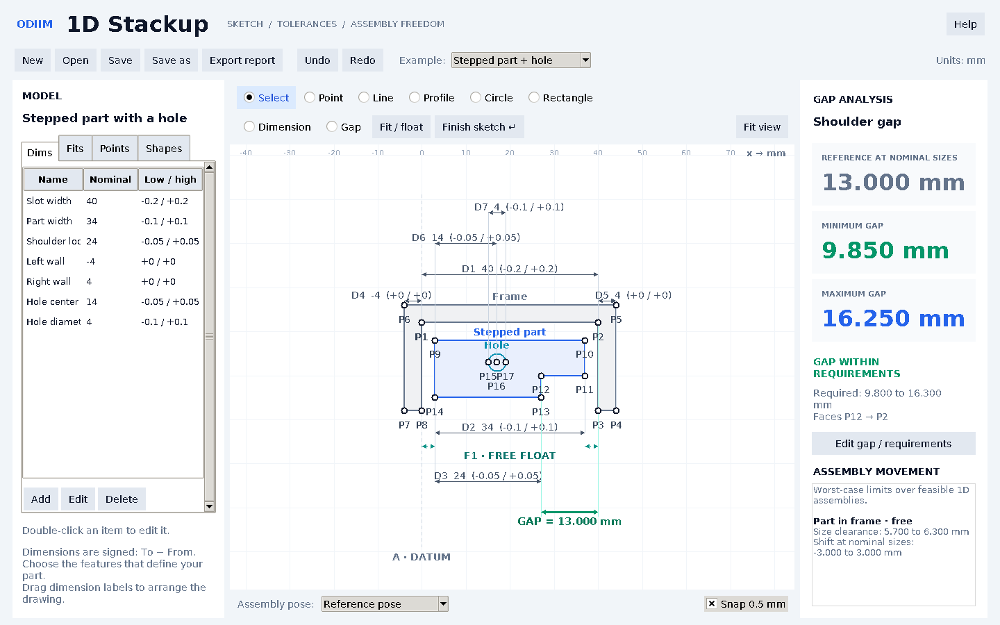

# Odiim 1D Stackup

A Python desktop app for sketching a one-dimensional assembly, entering
dimensions and tolerances, and calculating the minimum and maximum functional
gap. Assembly clearance, contact and available translation are part of the
same calculation.



## Start on Windows

1. Install Python **3.10 or newer**, including **Tcl/Tk and IDLE**.
2. Extract the project into a normal folder.
3. Double-click **`run.bat`**. On its first run it creates a local virtual
   environment and installs SciPy. Internet access is needed for that install.

Or run these commands from the project folder:

```powershell
python -m pip install -r requirements.txt
python main.py
```

On Linux or macOS:

```sh
sh run.sh
```

Tk must be available in your Python installation. Linux distributions may
package it separately as `python3-tk`. The app runs offline after installation.

## Sketch an assembly

1. Click **New** and choose **Body**.
2. Click the left and right face positions. Enter a name, nominal width, lower
   deviation and upper deviation. Choose **Housing / slot** for a cavity.
3. Add more bodies or individual face **Points**.
4. Select **Dimension**, then click its **From** and **To** points. You can also
   use **Add** in the **Dims** tab and choose points from dropdowns.
5. Locate the parts with dimensions, face contacts, placement ranges or
   **Fit / float**. Drawing rectangles next to each other does not create a
   contact automatically.
6. Select **Gap**, then click the two faces. Define optional required limits.
7. Switch **Assembly pose** between the reference, minimum-gap and maximum-gap
   assemblies to see the actual positions producing each result.

Double-click a dimension, point, body or fit to edit it. Right-click a point
to set datum **A**. Use the wheel to zoom, middle-drag to pan, and **Fit view**
to recenter. Undo/redo uses **Ctrl+Z / Ctrl+Y**.

All numeric inputs use **mm**. Both a decimal point and decimal comma are
accepted. The canvas y-coordinate is layout only: this is a **1D x-axis**
calculation, not a 2D geometric solver. Dimensional values are entered
explicitly; sketch pixels do not replace a dimensional specification.

### Dimension types

| Type | Use |
| --- | --- |
| Manufacturing size | A signed dimensional specification and its manufacturing deviations. |
| Assembly placement / float | A bounded relative position, for example a mounting position of 10 mm with movement from −0.5 to +0.5 mm. |
| Face contact | Zero separation between two separate face points. |

For a dimension from A to B:

```text
nominal + lower deviation ≤ x(B) − x(A) ≤ nominal + upper deviation
```

For a conventional 25 ±0.1 mm dimension, enter nominal `25`, lower `-0.1`,
upper `0.1`. For a reversed signed dimension, select the endpoints accordingly
and use a negative nominal value.

### Assembly fits and shift

Select four distinct points in **Fit / float**: the slot's left/right limits
and the moving body's left/right faces. Dimension both widths.

| Fit condition | What is enforced |
| --- | --- |
| Free float | The body stays within the slot and may translate until either wall is contacted. |
| Left face in contact | The body is seated against the left wall. |
| Right face in contact | The body is seated against the right wall. |
| Centered | Left and right gaps are equal; the centering condition holds at every permitted size. |

The free-fit constraints are:

```text
slot_left ≤ body_left ≤ body_right ≤ slot_right
```

Manufacturing dimensions and these assembly positions are solved together.
The available float therefore changes with the actual part sizes. Shared face
positions are reused across all relations, preserving cancellation and coupling.
Additional features on the moving part must be connected by dimensions to
its existing faces; this connects them to the same movement.

**Checked example:** a slot of **40 ±0.2 mm** and a body of **34 ±0.1 mm**.

| Assembly condition | Right-side minimum gap | Right-side maximum gap |
| --- | ---: | ---: |
| Free | 0.000 mm | 6.300 mm |
| Left seated | 5.700 mm | 6.300 mm |
| Right seated | 0.000 mm | 0.000 mm |
| Centered | 2.850 mm | 3.150 mm |

Total size clearance is **5.7–6.3 mm**. In a centered nominal reference pose,
free movement at nominal sizes is **−3 to +3 mm**. The full gap extremes also
include the influence of the size tolerances on the available movement.

The **reference** result uses nominal manufacturing sizes and chooses a
feasible assembly position as close as possible to the requested sketch.
It is one selected pose, not a statistical average. Dragging a free body
requests another reference pose; it does not change the specified dimensions
or the worst-case gap limits. Each fit's reported shift is measured from this
reference pose relative to the slot's left face, at nominal manufacturing sizes.

## Understand the result

- **Gap within requirements:** all feasible gap values satisfy the entered gap
  limits. This statement alone does not certify production assembly yield.
- **Size fit risk:** some permitted slot/body size combinations interfere.
  The app checks size clearance before imposing containment so these failures
  remain visible, even when the gap for compatible assemblies passes.
- **Unbounded:** the two gap faces are not sufficiently located relative to
  each other. Add a contact, placement range, connecting dimension or fit.
- **Infeasible:** no assembly satisfies all the declared relations. A small
  set of conflicting conditions is listed.

The gap extrema cover **feasible assemblies**. The size-clearance check
audits each fit independently. Multiple coupled fits, closed dimensional
loops or other restrictive contacts may exclude additional manufactured
combinations; this app does **not** certify that every allowed combination
can be assembled in such a system.

The model handles 1D linear dimensions, stated contacts and translational
freedom. Rotation, angular/form errors, elastic deformation and full 2D/3D
GD&T are outside its scope. There is no assumed probability distribution,
RSS approximation or assembly failure-rate estimate.

## Save and export

- **Save** creates a portable `.stackup.json` project. Writes are atomic.
- **Export report → HTML** produces a self-contained report with all three
  assembly sketches, extrema, dimensions, fit clearance and movement.
  Open it in a browser and print to PDF if desired.
- **CSV** exports dimensions, actual dimensions at both gap extremes, fit
  movement and result notes.
- **SVG** exports the currently displayed vector sketch.

Five examples are available in the app and in the `examples/` folder:
floating block, centered block, serial chain, mounting float, and a partial
fit/interference case.

## Command-line analysis

```sh
python main.py examples/floating-block.stackup.json --analyze
python main.py examples/floating-block.stackup.json --analyze --report report.html
```

CLI exit code `0` means analysis completed with bounded gap limits; it does not
mean the gap passes the requirements or that every size combination fits.
Infeasible, incomplete or unbounded analysis returns `2`; file/startup errors
return `1`.

## Validation

```sh
python -m unittest discover -s tests -v
```

Tests check signed and asymmetric chains, shared-face cancellation,
clearance-dependent float, contact and centered conditions, internal features,
reference-pose changes, interference, unbounded and inconsistent models,
project persistence, exports, and an interactive sketch/edit/undo workflow.
The GUI test requires a display; it is skipped on a headless machine.

SciPy's HiGHS linear-programming solver computes the gap extrema. Feature
coordinates are allowed to be negative; no unintended non-negative coordinate
bounds are imposed. Solver feasibility tolerance is `1e-9` mm; requirement
comparisons use `1e-7` mm to handle floating-point roundoff.

Primary references used for the calculation approach:

- [SciPy: `linprog` and its constraint/bound conventions](https://docs.scipy.org/doc/scipy/reference/generated/scipy.optimize.linprog.html)
- [MIT Robust System Design: tolerance analysis](https://ocw.mit.edu/courses/16-881-robust-system-design-summer-1998/725e6afee0f0698780362e394cd2dac7_l15_tol_des3.pdf)

This implementation formulates the stated 1D assembly relations as linear
constraints. The references explain the underlying tools and tolerance-analysis
context; they are not a certification of this application.
